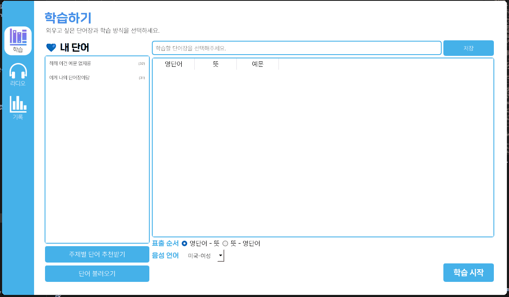

# 삡(Pip) 단어장!


> 영어에 꽂혀버려 영어 어플만 3개 구독중임에도 느껴진 갈망을 모앗다!

> 진짜 갑자기 너무 갖고 싶은 기능을 3일간 구현하였다!!

<br><br>

## 대강 기능 어필!

### 😂 PC용 나만의 괜찮은 단어장 없나?
: 내가 외울거 외운거 딱딱 정리해서 보고싶은데 방법없나?


 - 메모장에 간단히 적으면 단어장 출력 완성!
 - 부지런한 당신 예문도 넣었다면 그것도 모아준다!
 - 화면 살짝 가리고 단어만 먼저 뜻만 먼저 골라 보자!
 - 뭐야 뜻이 하나 더 있어? 수정 가능~!

<br><br>

### 링딩동마냥 반복식 주입하면 외워지지 않을까? 🤔
: 좋아 학습을 해보자!!


> 이 쪼꼬미는 뭘까?


<br><br>

### 무한 반복 쪼꼬미 단어장 등장!! 🤷‍♀️
: 화면 구석 조그마하게 항상 떠있는 나만의 단어장!


 - 단어도 읽어줘~
 - 계속 반복도 해줘~
 - 예문도 보여줘~
 - 출근해서 퇴근까지 틀어놓으면 뭐지 들어는 봤는데? 가능하지 않을까!!
 

<br><br>

### 👻 자만하는 나를 위한 실전 검증!
: 어디 직접 외운 단어로 구성된 라디오를 알아듣는지 테스트 해보시지!

[Link text](https://github.com/user-attachments/assets/3427885d-b1d0-4c81-8a94-967d6fe900fc)
> 아닛! 단어장을 선택해서 라디오를 만들어준다구? (클릭해서 영상을 확인하세요!)

<br><br>


[Link text](https://github.com/user-attachments/assets/3ad33cfe-e5ae-4c79-94e6-1087fd67d425)

 > 좋아! 직접 라디오를 생성해보자!! (클릭해서 영상을 확인하세요!)
 - 대본 생성에 [OpenAI API](https://openai.com/index/openai-api/)가 들어서 5$ 정도만 구매해도 한참 쓴다...!! 이건 투자할 수 있따!
 - 단어를 고르고, 생성하기 누른 뒤 새로고침을 연타하세요!
 - 한글/영어/단어 아는게 많을 수록 인터페이스가 단촐할 것입니다...
 - 계속 다른 대본을 만들어서 검증해보세요!

<br><br>

### 윈도우, 맥, 리눅스 지원 🙊
|구분||||
|:--:|:--:|:--:|:--:|
|Windows||||
|Mac|맥에서 음성 파일이 실행이 안된당|이건 오늘 중으로| 꼮 고쳐야지! |
|Linux||||


## 실행법 및 주의사항

### 설치 및 실행
 1) **[Conda](https://www.anaconda.com/download) 다운로드**
 
 2) **코드 가져오기** <br>
  : `zip` 다운로드든 어떻게든 가져오기
 ```sh
 git clone https://github.com/oMFDOo/pipVocabularyList.git
 ```


 3) **가상환경 생성**
 ```sh
 conda env create -f enviroment.yml
 ```

 3) 코드 실행
 ```sh
 python main.py
 ```

<br>

### ❗❗❗단어 추가❗❗❗
: 단어를 파일로 추가할 때는 이렇게 써야한다..! 둘 중 하나의 양식만 충족하면 된다!<br> 또한 파일명이 단어장 이름으로 추가된다. 그래도 제목은 수정 가능하니 안심!

1) **단어만 추가**
```py
# 영단어
# 뜻
ameliorate  
개선하다, 향상시키다
```


2) **단어+예문 추가**
```py
# 영단어
# 뜻
# -영문 예문 +한국어 뜻
ameliorate  
개선하다, 향상시키다  
-The manager worked to ameliorate the company+매니저는 회사를 개선하기 위해 노력했다  
```


<br><br>


## 미래의 포부!

### 내가 더 부지런할 때 만들것
 > 정말 취미로 만든것이라, 당분간 다른 개인 공부의 문제로 개발 중단함

- [ ] 단어 생성 : 테마를 고르고 단어를 생성해주는 기능
- [ ] pip 고도화 : 불투명도나 다크모드 조정 있으면 좋을 듯 하다
- [ ] 볼륨조절 : 윈도우는 시스템 볼륨 조절 가능한데 mac이나 linux는 어렵단 말이다!
- [ ] 예문생성 : 솔직히 예문까지 적어넣기 귀찮으니까...
- [ ] 인종추가 : 호주, 영국, 남성/여성 옵션 추가 - 이건 너무 무거워 질 거 같아서 정말 고민
- [ ] API키 저장 : 매번 붙여넣기 귀찮타
- [ ] 무료 전환 : 대본 삽입 기능만 있다면 완전 무료가 되긴하니까...
- [x] 단어 삭제 : 파일 exe로 뽑아서 안 쓸거라 지금은 문제 없지만 꽤 거슬릴 일
- [ ] 창끄기 : 없이도 잘 갖고논게 용함
- [ ] mac 다크모드 연동 : mac에 다크모드 설정되어 있으면 창 일부가 까매지고 글자는 안 보이는 훌륭한 일들이 생긴다.
- [ ] exe 뽑아내기 : 실행이 번거롭지 않아서인지 그냥 실행해 쓰고 있으나, 각 os 별 프로그램 파일 추출 한 번 해서 업로드 하자.
- [ ] txt로 단어 편집 : gpt 쫙 돌려서 얻은 txt를 나는 수정해 쓰는데, 이거 프로그램 내에서도 되면 편할 거 같다.
- [ ] 단어장 동기화 : 단어장 수정/생성 후 껐다 켜야 라디오 페이지에 반영되고 있다.

<br><br>


## 업데이트 로그
### - 2025.02.07 : 예문 읽기 기능 추가 및 가벼운 오류 수정
  + 예문을 읽어주는 기능을 개발하였으며, 토글 버튼으로 끄고 킬 수 있다. 
  + playsound 1.3 버전이 임시 파일 닫기 오류가 존재해 1.2.2 버전으로 변경되었다.

### - 2025.02.04 : 단어장 편집/삭제 기능 추가
  + 단어장을 새 창을 통해 직접 작성하고 추가할 수 있다.
  + 가지고 있는 단어장 삭제가 가능해졌다.
  + 기존 단어 수정만 가능하였으나, 행 추가/삭제 기능이 추가되어 가지고 있는 단어장에 새로운 단어를 추가/삭제가 가능해졌다.

### - 2025.04.16 : 단어장 전체 복사 기능 추가
  + 현재 보고 있는 단어장의 단어 전체를 복사한다.
  + 셔플을 누르고 저장하지 않아도 셔플된 단어 복사가 가능하다.
  + 복사한 단어를 엑셀에 붙여넣어 인쇄하면 바로 나만의 단어장 뚝딱.
